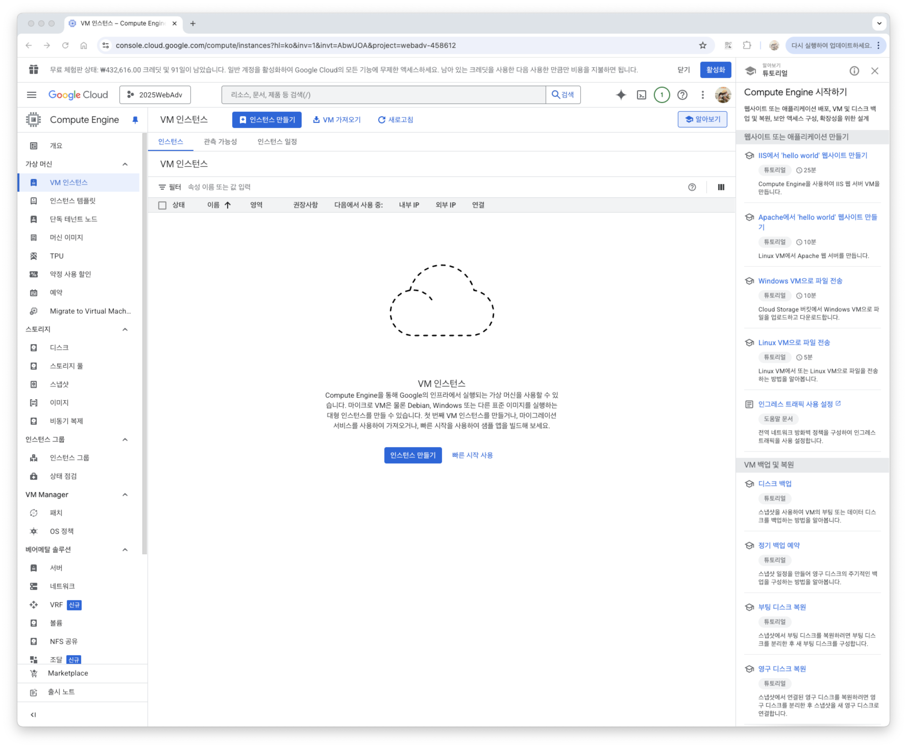
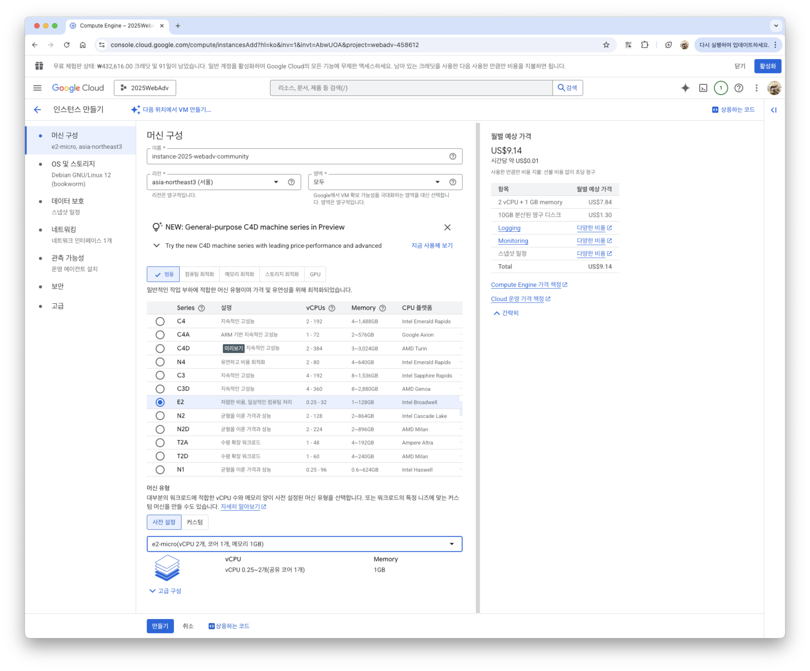
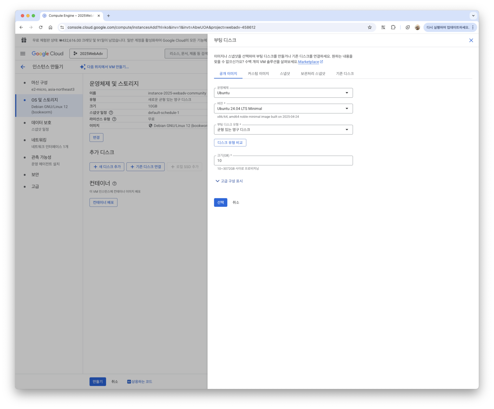
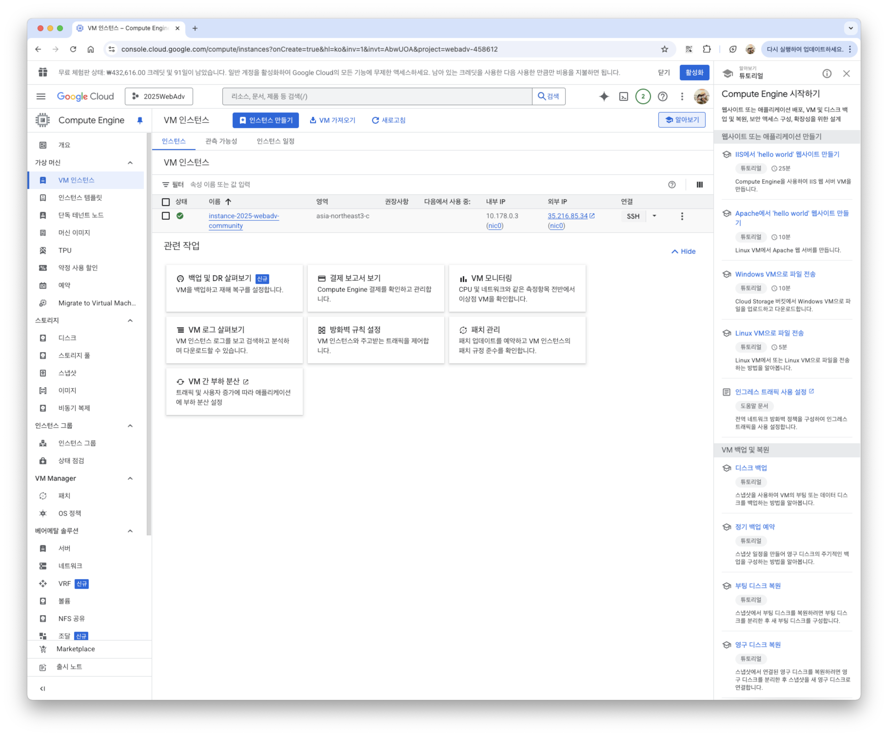
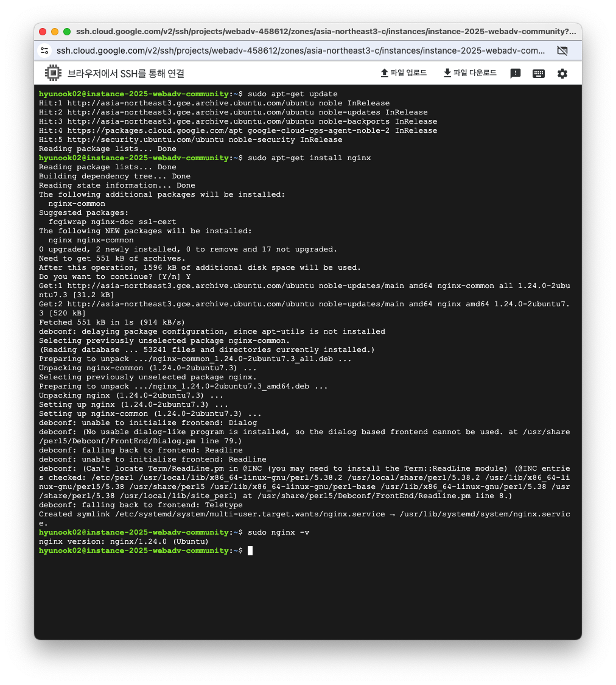
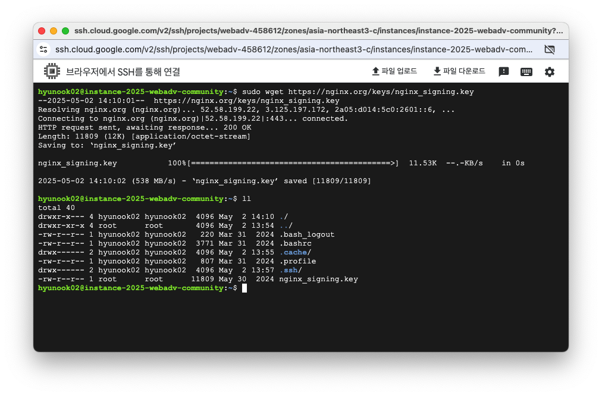
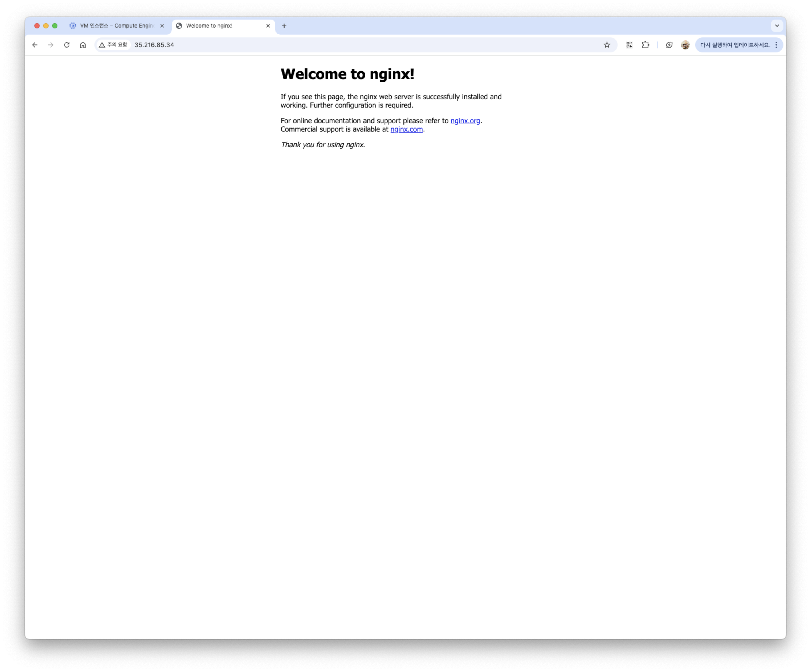
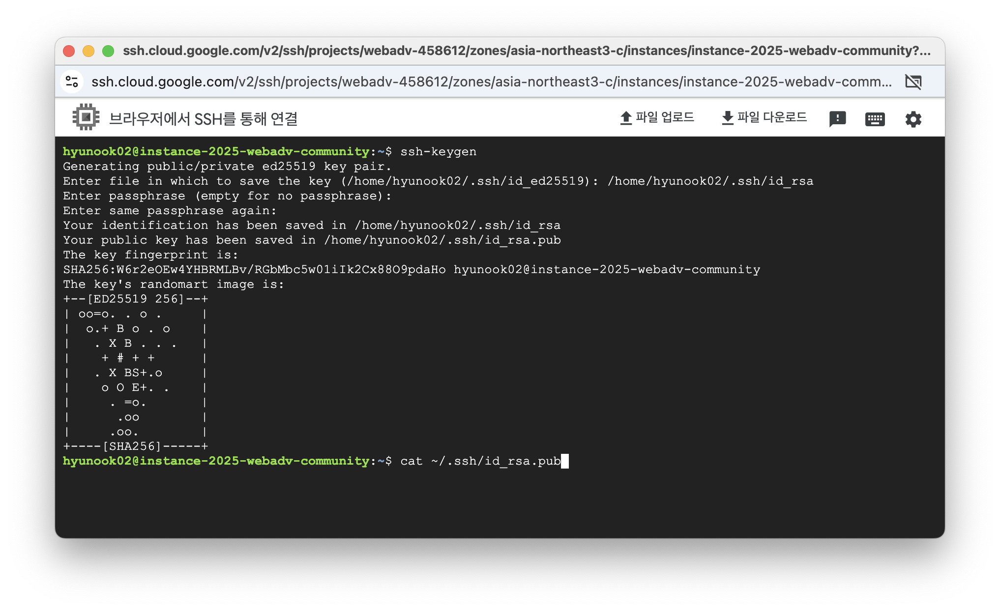
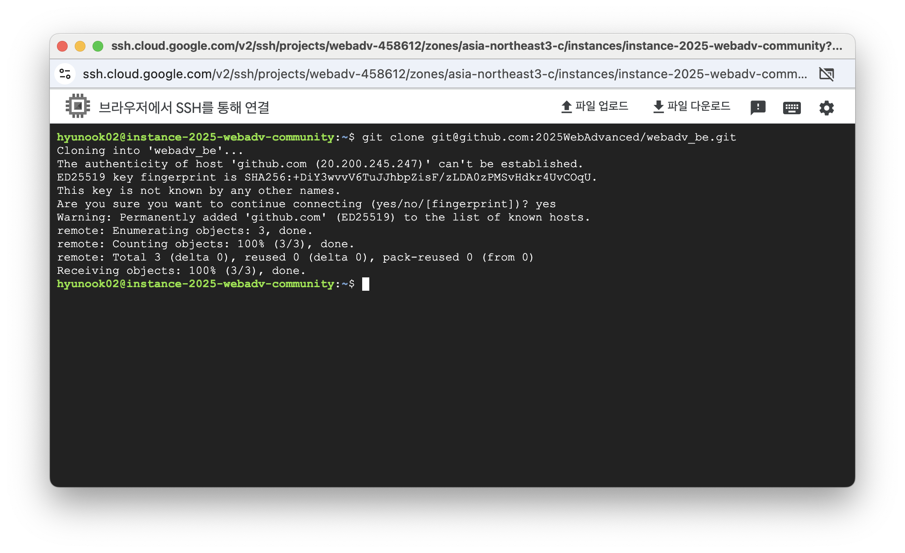

# webadv_be
2025년 1학기 웹프로그래밍응용 게시판 팀 프로젝트 백엔드 리포지토리

## 기술 스택


> - 서버: 구글 클라우드 컴퓨팅 서비스
> - 웹서버: Nginx
> - 웹앱 프레임워크: Express
> - DB: MySQL

## 서버 세팅
### 1. 클라우드 컴퓨팅 인스턴스 만들기
#### 구글 클라우드 접속
Google Cloud 접속 후, Compute Engine - VM 인스턴스 클릭

인스턴스 만들기 클릭<br>
#### 인스턴스 생성 (머신 구성)
이름 작성 후, 리전: asia-northeast3(서울) 선택, 머신 유형: e2-micro 선택


#### 인스턴스 생성 (OS 및 스토리지)
Ubuntu 24.04 LTS Minimal x86/64 선택


#### 인스턴스 생성
- 데이터 보호: 백업 없음 체크
- 네트워킹: HTTP, HTTPS 트래픽 허용, 네트워크 인터페이스 - 네트워크 서비스 계층: 표준 체크

### 2. 인스턴스 연결
생성된 인스턴스 가장 오른쪽의 SSH 버튼 클릭해서 접속


```bash
sudo apt-get update
```

vim 에디터조차 안깔려있기 때문에 설치
```bash
sudo apt-get install vim
```

git 설치
```bash
sudo apt-get install git
```

### 3. Nginx 웹서버 설치
#### 우분투에 Nginx 설치
```bash
sudo apt-get install nginx
```
```bash
sudo nginx -v
```

#### 우분투 패키지 설치
```bash
sudo wget https://nginx.org/keys/nginx_signing.key
```


#### 동작 확인
구글 클라우드 VM 인스턴스에서 **외부 IP** 복사<br>
웹 브라우저 주소창에 **http://복사한IP** 붙여넣기

위와 같은 화면이 나오면 정상 작동

### 4. 프로젝트 클론
#### ssh 키 생성 및 등록
##### ssh 키 생성
```bash
ssh-keygen
```

##### 공개 키 등록
```bash
cat ~/.ssh/id_rsa.pub
```
결과 복사 후 깃허브 - settings - SSH and GPG keys 접속해서 공개 키 등록

#### 깃허브 리포지토리 clone
```bash
git clone git@github.com:2025WebAdvanced/webadv_be.git
```
